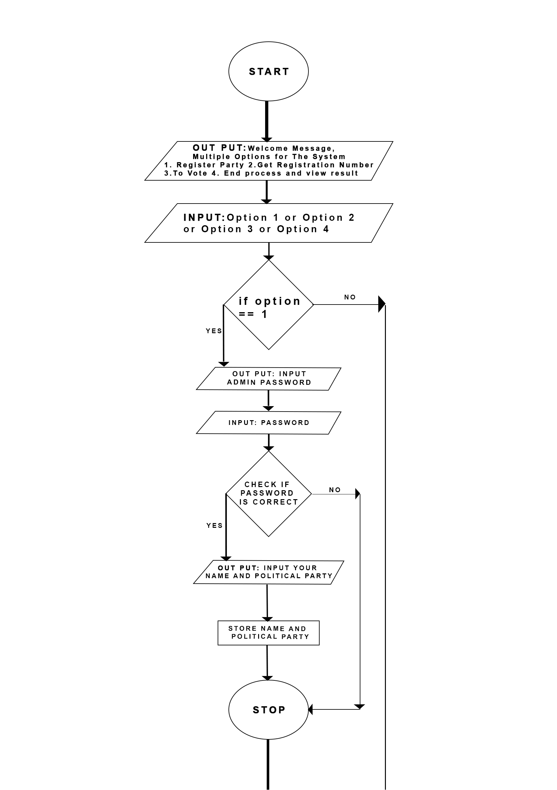

# Voting System
 A voting system written with C++.

<h2> KUSHIMO MOSOPEFOLUWA </h2>

<h2> PROJECT TITLE: VOTING SYSTEM </h2>
<ol>
 
 <li> 	 Introduction </li>

 <li> 	System Analysis </li>

 <li> 	Use Case Diagram </li>

 <li> 	Source Code Breakdown </li>

 <li>	Flow Chart </li>

 <li> 	The Source Code </li>

<h2> The Proposed System: </h2>

 The proposed system is to produce a voting system that enables aspirants and voters to have a secure, non-biased and transparent means of registering and voting.  

How The Program Should Work:  

The program is to allow all Aspirants to register under the authentication of the Electoral officials.   

The program then allows the voters to register on the system also with authentication from the Electoral officials but before the voters are allowed to register, the system checks if they are at least 18 years old. If all criteria are met, the voter is given a unique ID to vote.  

The program allows all qualified voters to vote by requesting for the unique ID given to them during registration. The unique ID is checked for its validity before allowing the voters to cast their vote.  

The votes are recorded and stored.  The program is ended by the Electoral official by inputting the correct password. If the password is right, the result is displayed and the winner is declared. If there is a tie, the system declares a tie.  

The Actors of the system:  

There are two set of actors in this system  
 <ol>
 <li> 	The Primary Actor(s): These are the individuals who us the system to achieve a goal. In this case, the primary actors are the Voters and the Aspirants. </li>

 <li> 	The Secondary Actor(s): These are the individuals that assist the system in archiving user goals. In this program, the secondary actors are the Voting Officials. </li>
  </ol>

<h3>The User Requirements:</h3>

<u> The Voters </u>  
<ol>
<li> The voters shall be able to register. </li>
<li> The voters shall be given a unique ID. </li>
<li> The voters shall be able to vote for the aspirant of their choice. </li>
<li> The voters shall be able to view the election result after the election has ended. </li>
</ol>

<u> The Aspirants </u>  
<ol>
<li>The aspirants shall be able to register.</li>
<li>The aspirants shall be able to be voted for.</li>
<li>The aspirants shall be able to vote.</li>
<li>The aspirants shall be able to view the election result after the election has ended.</li>
</ol>

<u> The Voting Officials </u>
<ol>
<li>The voting officials shall be able to start the voting process.</li>
<li>The voting officials shall be able to oversee the voting process.</li>
<li>The voting officials shall be able to end the voting process.</li>
<li>The voting officials shall be able to view the election result after the election has ended.</li>
</ol>

<u> The System Requirements </u>
<ol>
<li>The system shall be able to register 25 aspirants and their various parties.</li>
<li>The system shall be able to register 1000 voters.</li>
<li>The system shall have a maximum response time of five (5) seconds.</li>
<li>The system shall be able to generate unique ID numbers for all registered voters.</li>
<li>The system shall be able to run for a minimum of 24 hours without failure.</li>
<li>The system shall be able to detect a tie.</li>
<li>The system shall be able to stop a voter from voting twice</li>
<li>The system shall be able to allow all aspirants to register at once</li>
<li>The system shall be able to identify the winner of the election</li>
</ol>

<h3>USE CASE DIAGRAM FOR THE VOTING SYSTEM</h3>

 
		

THE SOURCE CODE:
	
Libraries Used:
1.	#include<iostream>

2.	#include<ctime>

3.	#include<sctdlib>

Functions created:
1.	bool check(int num){
int track = num;
    int count = 0;
   while(track > 0){
      track = track/10;
      count++;
      //to check number of times Num can be divided by 10 and the number of times is 6 which presents 6 digits
}
   num = num % 10000;//to get the last 4 digits of 6 numbers 4 zeros
   bool good = ( ((num%4==0)&&(num%400==0||num%100!=0)) && (count == 6) );
   // first verification is to see if the number is divisible by (4) and then (400) and not (100)
   // second verification then checks if the digits is (6)
   return (good)? true : false;//if all Requirements are met then the number is valid return true else false
}

2.	bool linearSearch(int regNum, int store[], int size){
for(int i = 0; i<size; i++)
     if(store[i] == regNum){return true;}
     return false;
/*checks the array storing the values of the valid regNumbers
  if regNum is in the array it return true
  else it rerurn false*/
}

3.	int winChecker(int[], int);
int max = 0,index = 0;
    for(int i = 0; i<len; i++){//check the particular index who has the highest value and return the index as the winner
   if(numTimesPicked[i] > max){
   max = numTimesPicked[i];
   index = i;
}
}
   return index+1;
}

4.	int regGiver(){
srand(time(0));//gets the time
   int validNum;
    for(int i = 1; i<15; i++){
    int num = (rand()%10000)+(i*10000);//generates the random number
    if( check(num) )//passes the number to the function check and sees if the number is valid
    validNum = num;
   }
   return validNum;
}

5.	bool tieFinder(int array[], int size){
for(int i = 0; i<size; i++){
      for(int j = i+1; j<size; j++)
      if(array[i] == array[j] && array[i] != 0 && array[j] != 0){return true;}
   }
   //using nested loop it checks if a particular value other than 0 repeats itself that means there is a tie return true
   return false;
}

Arrays created:
1.	int storeRegNumber[15];

2.	numTimesPicked[20];

3.	string party[25];

4.	string name[25];

Arithmetic Operation created:
1.	int lenPicked = sizeof(numTimesPicked)/sizeof(numTimesPickes[0]);

Control Structure:
	Selection;
1.	if else statement.
Iteration;
1.	for loop
2.	while loop

    

THE CODE:

#include<iostream>
#include<ctime>
//to import the timne library for the random number generartor
#include<cstdlib>
//to import the random numnber generator RAND
#include<string>
using namespace std;

bool check(int);//to check if the regnumber fits the requirement
bool linearSearch(int,int [],int);//to search the given array for stored regNumber and see if the number is present
int winnerChecker(int[],int);//checks the array and sees the voter who has the highest number of voted and returns the index
int regGiver();//this gives the user a  random regnumber using the ctime and cstdlib library
bool tieFinder(int[],int);//this finds if there are any ties within the loop if any number re occurs

int main(){
    int storeRegNumber[1000];//to store the valid regnumber
    int numTimesPicked[1000] = {0};//to store the number of votes each person has
    int lenPicked = sizeof(numTimesPicked)/sizeof(numTimesPicked[0]);
    int regNumber, input, pass = 0, index = 0,adminPin = 1234;
    string party[1000] = {""};//parties
    string name[1000] = {" "};//names
    int arraySize = 1;
    cout<<"\n--------------------------------------------\n";
   cout<<"\n\tVOTING MANAGEMENT SYSTEM\n";
   cout<<"\n--------------------------------------------\n";
         cout<<"\n--------------------------------------------\n";
          cout<<"\t\tWELCOME TO\n";
          cout<<"SOPE'S VOTING MANAGEMENT SYSTEM";
          cout<<"\n--------------------------------------------\n";
    bool end = false;//boolean set as false for the program to run while its not end i.e true
   while(!end){
   cout<<"\n-----------------------------------------------";
   cout<<"\n\n[1]REGISTER PARTY\n[2]GET REGISTRATION NUMBER\n[3]TO VOTE\n[4]END VOTING PROCESS AND VIEW RESULTS\n\n";
   cout<<"-----------------------------------------------\n";
   cout<<"-----\nINPUT OPTION NUMBER - ";
   cin>>input;
   switch(input){
      //REGISTER PARTY
      case 1:{
         int pin;
         cout<<"\nF O R  A D M I N S\n";
           cout<<"\n------------------\n|INPUT ADMIN-PIN|\n------------------\n";
           cout<<"- --"<<endl;
           cin>>pin;
           cout<<"- --"<<endl;
           cout<<"VALID PIN\n\n";
           if(pin == adminPin){//value of adminPin set as 1234
              cout<<"NUMBER OF NEW PARTIES - ";
              cin>>pass;
              for(int i = arraySize; i<pass+arraySize; i++){
                  cout<<"\n["<<i<<"]"<<endl;
               cout<<"NAME OF NEW PARTY:";
                  cin>>party[i];
                  cout<<"NAME OF REPRESENTATIVE:";
                  cin>>name[i];
             }
             cout<<"\nSUCCESFULLY ADDED";
          }
          else
          cout<<"WRONG PIN";
         break;
   }
          case 2:{
              //GET REGISTRATION NUMBER
           int age;
         string name;
         cout<<"\n-----------\n|INPUT AGE|\n-----------\n";
         cin>>age;
         if(age>=18){
         cout<<"\nVALID AGE LEGIBLE TO VOTE\n";
         cout<<"WHAT IS YOUR NAME: ";
         cin>>name;
         cout<<"MR/MRS."<<name<<"\n-----------------------\n|THIS IS YOUR REG-NUMBER|\n-----------------------\n"<<regGiver();
         //calls the regGiver function which gives the participant a random regNumber
         }
         else
         cout<<"TO YOUNG CANT BE GIVEN REG-NUMBER";
         break;
         }
         case 3:{
          //TO VOTE
         cout<<"\n------------------\n|INPUT REG-NUMBER|\n------------------\n";
         cout<<"- - - -"<<endl;
         cin>>regNumber;
         cout<<"- - - - "<<endl;
         int sizeStore = sizeof(storeRegNumber)/sizeof(storeRegNumber[0]);
         bool validRegNumber  = check ( regNumber );
         //checks the number input by the user and passes it to the function which checks if it is a valid reg number
         bool hasVoted = linearSearch(regNumber,storeRegNumber,sizeStore);
         //checks if the user has voted by checking is the current reg number put by the user is in array
         if(hasVoted)
         cout<<"PARTICIPANT: "<<"\""<<regNumber<<"\""<<" You Have Already Voted Dont Try It Again";//if true cant vote again

          else if( validRegNumber ){
          storeRegNumber[index] = regNumber; //stores the valid regNumber in the array
            int select;
         cout<<"VALID REG-NUMBER\nWHO DO YOU WANT TO VOTE FOR\n\n";
            if(arraySize+pass<2) {
                cout << "NO PARTIES HAVE BEEN REGISTERED";//to see if any parties have been registred
                break;
            }
            for(int i = 1; i<arraySize+pass; i++){//to write all the participants name
               if(i % 2==0)
               cout<<"["<<i<<"]."<<name[i]<<" "<<party[i]<<endl;
               else
               cout<<"["<<i<<"]."<<name[i]<<" "<<party[i]<<"\t\t";
}
            cout<<"\n\nVOTE- ";
         cin>>select;
         if(select > 0  && select < arraySize+pass){//makes sure input is valid
         numTimesPicked[select - 1] += 1;
          //number of Votes increases by +1 depending on the number of times person is voted for by adding one at the index @numTimes
           cout<<"\n------------------\n      PARTICIPANT|\n------------------\n";
         cout<<regNumber<<"\nVOTED FOR\n++++++++++++++++++\n";
         cout<<"NAME:"<<name[select]<<"\nPARTY:"<<party[select]<<"\n------------------\n|T H A N K  Y O U|\n------------------\n";
       }
          else
          cout<<"VOTE FOR A VALID CANDIDATE";
     }
         else
         cout<<"\n... ERROR INVALID REG-NUMBER\n";
         break;
      }
      case 4:{
         //END PROCESS
          end = true;//end becomes true  to end the while loop
          int pin;
          cout<<"\nF O R  A D M I N S\n";
           cout<<"\n-----------------\nINPUT ADMIN-PIN |\nTO  END PROCESS |\nAND VIEW RESULTS|\n-----------------\n";
           cout<<"- --"<<endl;
           cin>>pin;
           cout<<"- --"<<endl;
           if( pin == adminPin ){
           cout<<"CORRECT PIN\n";
           int sum = 0;
         bool foundTies = tieFinder(numTimesPicked,lenPicked);//function returns true if a number repaest itself
         int winner = winnerChecker(numTimesPicked,lenPicked);//function returns the value with the highest votes
         for(int i:numTimesPicked)//for in range loop to check the total number of votes assigns the value to sum
         sum = sum+i;
          if(sum > 0){//if sum > 0 means someone has voted
           cout<<"\n-------\t------\t------------------";
          cout<<"\n|PARTY|\t|NAME|\t|NUMBER  OF VOTES|\n";
          cout<<"-------\t------\t------------------\n";
          for(int i = 0; i < arraySize+pass; i++)//
          cout<<party[i+1]<<"\t"<<name[i+1]<<"\t\t"<<numTimesPicked[i]<<endl;//to print parties and representatives
          cout<<"\n------------------\nT H E  W I N N E R|\n------------------\n"<<name[winner]<<endl;//shows winner
         cout<<"\n----------------------\nTOTAL NUMBER OF VOTES|\n----------------------\n"<<sum;//shows total num of votes
          cout<<"\n------------------\nT I E S\n------------------\n";//shows if there were ties
          if(foundTies)
          cout<<"THERE WERE TIES"<<endl;
         else
         cout<<"THERE WERE NO TIES"<<endl;
      }
         else// else no person has voted
         cout<<"TO SEE RESULTS YOU HAVE TO VOTE FIRST";
          break;
         }
         else
         cout<<"WRONG PIN";
      }
}
index++;//keep track of number of times the loop has run and helps in the position of regNum
}
}
bool check(int num){
   int track = num;
    int count = 0;
   while(track > 0){
      track = track/10;
      count++;
      //to check number of times Num can be divided by 10 and the number of times is 6 which presents 6 digits
}
   num = num % 10000;//to get the last 4 digits of 6 numbers 4 zeros
   bool good = ( ((num%4==0)&&(num%400==0||num%100!=0)) && (count == 6) );
   // first verification is to see if the number is divisible by (4) and then (400) and not (100)
   // second verification then checks if the digits is (6)
   return (good)? true : false;//if all Requirements are met then the number is valid return true else false
}
bool linearSearch(int regNum,int store[],int size){
    for(int i = 0; i<size; i++)
     if(store[i] == regNum){return true;}
     return false;
/*checks the array storing the values of the valid regNumbers
  if regNum is in the array it return true
  else it rerurn false*/
}
int winnerChecker(int numTimesPicked[], int len){
   int max = 0,index = 0;
    for(int i = 0; i<len; i++){//check the particular index who has the highest value and return the index as the winner
   if(numTimesPicked[i] > max){
   max = numTimesPicked[i];
   index = i;
}
}
   return index+1;
}
int regGiver(){
   srand(time(0));//gets the time
   int validNum;
    for(int i = 1; i<15; i++){
    int num = (rand()%10000)+(i*10000);//generates the random number
    if( check(num) )//passes the number to the function check and sees if the number is valid
    validNum = num;
   }
   return validNum;
}
bool tieFinder(int array[],int size){
   for(int i = 0; i<size; i++){
      for(int j = i+1; j<size; j++)
      if(array[i] == array[j] && array[i] != 0 && array[j] != 0){return true;}
   }
   //using nested loop it checks if a particular value other than 0 repeats itself that means there is a tie return true
   return false;
}

